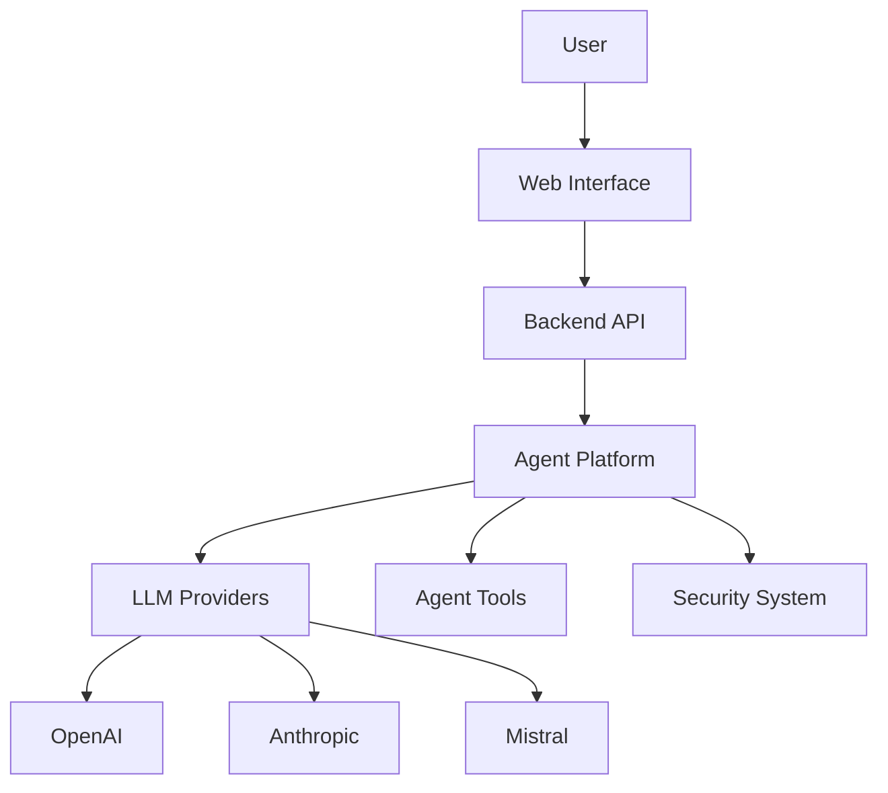
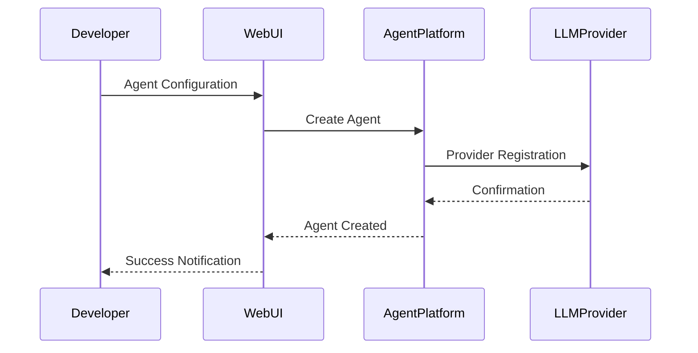

# 🤖 AI Agents SDK Web UI

[🇷🇺 Русская версия](README_RU.md)

<p align="center">
    
</p>

## 🌟 Project Overview

The AI Agents SDK is an innovative platform designed to revolutionize the way developers create, manage, and interact with intelligent AI agents. In an era of rapid technological advancement, our SDK provides a comprehensive toolkit that simplifies the complex process of building adaptive and intelligent systems.

**Key Philosophy**: Democratizing AI agent development by providing a flexible, secure, and easy-to-use framework that empowers developers of all skill levels.

### 🎯 Why AI Agents Matter

In today's fast-paced digital landscape, AI agents are transforming how businesses and individuals solve complex problems:
- Automating repetitive tasks
- Providing intelligent insights
- Enhancing decision-making processes
- Enabling personalized user experiences

## 🚀 Key Features

### 🧠 Intelligent Agent Management
Our SDK offers a robust set of tools for creating sophisticated AI agents with minimal complexity:
- Multi-model support across leading AI providers
- Flexible configuration options
- Dynamic tool integration
- Comprehensive monitoring and tracing

### 🔧 Technical Advantages
- Cross-platform compatibility
- Advanced security mechanisms
- Scalable microservice architecture
- Extensible plugin system

## 🌐 System Architecture



Our architecture is designed with modularity and scalability in mind, allowing seamless integration and expansion of AI capabilities.

## 🛠 Technology Stack

### Backend


### Frontend


Each technology is carefully chosen to provide optimal performance, developer experience, and future-proofing.

## 📊 Agent Creation Workflow



This workflow illustrates the streamlined process of creating and deploying intelligent agents.

## 🚀 Quick Start

### Prerequisites
- 🐍 Python 3.9+
- 📦 Node.js 18+
- 🐳 Docker (optional)

### Installation

```bash
# Clone repository
git clone https://github.com/ivan-meer/agents-sdk-web-ui.git
cd agents-sdk-web-ui

# Setup backend
python -m venv venv
source venv/bin/activate
pip install -r requirements.txt

# Setup frontend
cd frontend
npm install
```

## 📘 Documentation

### 🏗 Architecture
- [📄 Architecture Overview](/docs/ARCHITECTURE.md)
- [🔌 API Reference](/docs/API.md)
- [🚢 Deployment Guide](/docs/DEPLOYMENT.md)

### 🤝 Contributing
- [🛠 Contribution Guidelines](/CONTRIBUTING.md)
- [🐛 Bug Report Template](/.github/ISSUE_TEMPLATE/bug_report.md)
- [✨ Feature Request Template](/.github/ISSUE_TEMPLATE/feature_request.md)

## 🛡️ Security

🔒 For vulnerability reporting:
- Email: `security@aiagents.com`
- [Security Policy](/SECURITY.md)

## 📊 Project Status


## 🏆 Project Milestones

- [x] Basic Architecture
- [x] Multi-model Support
- [ ] Comprehensive Documentation
- [ ] Advanced Security Tools
- [ ] Full Scalability

## 📜 License

🔑 MIT License - see [LICENSE](/LICENSE) for details

## 📞 Contacts

- 📧 **Email**: ivan.meer1990@gmail.com
- 💻 **GitHub**: [@ivan-meer](https://github.com/ivan-meer)
- 🌐 **Website**: [aiagents.com](https://aiagents.com)

---

<p align="center">
    <strong>🚀 Created with ❤️ by the AI Developer Community</strong>
</p>
