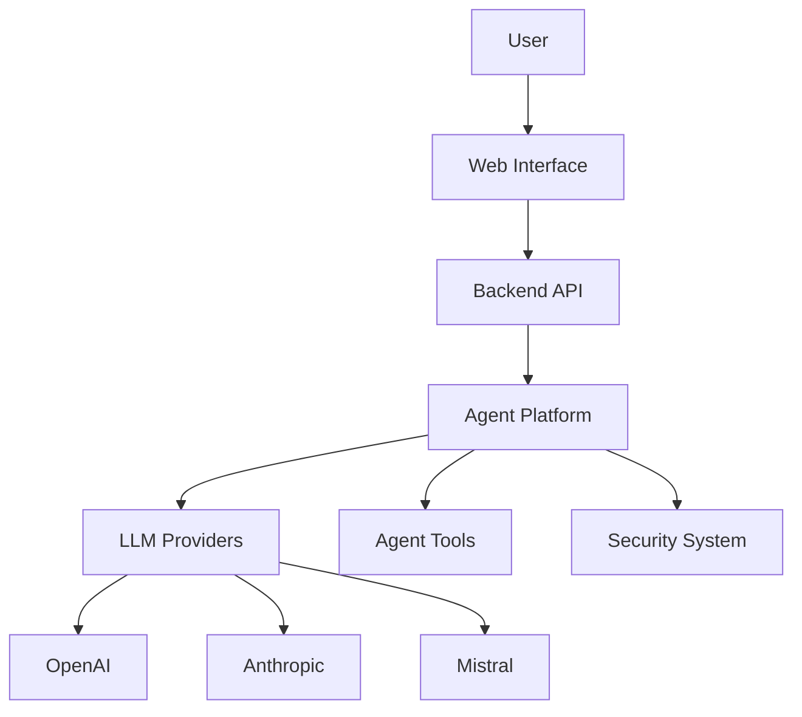
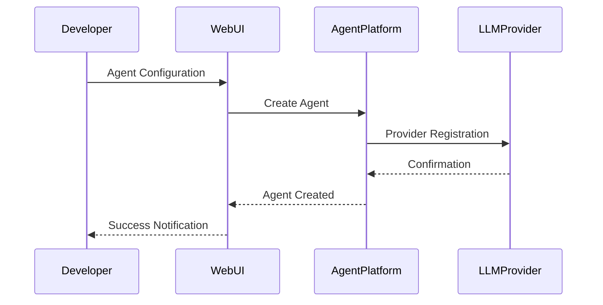

# 🌐 AI Agents SDK Web UI

<div align="center">
  
  
  [](https://github.com/ivan-meer/agents-sdk-web-ui/stargazers)
  [](https://github.com/ivan-meer/agents-sdk-web-ui/issues)
  [](LICENSE)
  [](https://github.com/ivan-meer/agents-sdk-web-ui/commits)
  [](https://github.com/ivan-meer/agents-sdk-web-ui/actions)
</div>

<p align="center">
  <b>
     English
  </b> | 
  <a href="README_RU.md">
     Русский
  </a>
</p>

## 🔍 Project Overview

The **AI Agents SDK** is an innovative platform designed to revolutionize how developers create, manage, and interact with intelligent AI agents. In an era of rapid technological advancement, our SDK provides a comprehensive toolkit that simplifies the complex process of building adaptive and intelligent systems.

> 💡 **Core Philosophy**: Democratizing AI agent development by providing a flexible, secure, and easy-to-use framework that empowers developers of all skill levels.

In today's fast-paced digital landscape, AI agents are transforming how businesses and individuals solve complex problems:
- Automating repetitive tasks
- Providing intelligent insights
- Enhancing decision-making processes
- Enabling personalized user experiences

## ✨ Key Features

<table>
  <tr>
    <td width="50%">
      <h3>🧠 Intelligent Agent Management</h3>
      <ul>
        <li>Multi-model support across leading AI providers (OpenAI, Anthropic, Mistral)</li>
        <li>Flexible configuration options with intuitive interface</li>
        <li>Dynamic tool integration for extended capabilities</li>
        <li>Comprehensive monitoring and performance tracing</li>
      </ul>
    </td>
    <td width="50%">
      <h3>🔧 Technical Advantages</h3>
      <ul>
        <li>Cross-platform compatibility for diverse deployment</li>
        <li>Advanced security mechanisms with OAuth2 authentication</li>
        <li>Scalable microservice architecture for enterprise needs</li>
        <li>Extensible plugin system for custom functionality</li>
      </ul>
    </td>
  </tr>
</table>

## 🏗️ System Architecture



Our architecture is designed with modularity and scalability in mind, allowing seamless integration and expansion of AI capabilities as your needs evolve.

## 💻 Technology Stack

<div align="center">
  <h3>Backend</h3>
  
  
  
  
  <h3>Frontend</h3>
  
  
  
</div>

Each technology is carefully chosen to provide optimal performance, developer experience, and future-proofing for your AI agent implementations.

## 🔄 Agent Creation Workflow



This workflow illustrates the streamlined process of creating and deploying intelligent agents through our platform.

## ⚡ Quick Start

### Prerequisites
- Python 3.9 or higher
- Node.js 18 or higher
- Docker (optional, for containerized deployment)
- API keys for desired LLM providers

### Installation

```bash
# Clone repository
git clone https://github.com/ivan-meer/agents-sdk-web-ui.git
cd agents-sdk-web-ui

# Setup backend
python -m venv venv
source venv/bin/activate  # On Windows: venv\Scripts\activate
pip install -r requirements.txt

# Setup environment variables
cp .env.example .env
# Edit .env with your API keys

# Setup frontend
cd frontend
npm install

# Start the application
# Terminal 1: Backend
cd ../backend
python main.py

# Terminal 2: Frontend
cd ../frontend
npm run dev
```

### Docker Installation

```bash
# Clone and setup
git clone https://github.com/ivan-meer/agents-sdk-web-ui.git
cd agents-sdk-web-ui
cp .env.example .env
# Edit .env with your API keys

# Build and run with Docker
docker-compose up --build
```

After installation, the application will be available at: [http://localhost:3000](http://localhost:3000)

## 📚 Documentation

<table>
  <tr>
    <td width="33%">
      <h3>🏗 Architecture</h3>
      <ul>
        <li><a href="/docs/ARCHITECTURE.md">Architecture Overview</a> (Updated 2025-03-20)</li>
        <li><a href="/docs/API.md">API Reference</a> (Updated 2025-03-22)</li>
        <li><a href="/docs/DEPLOYMENT.md">Deployment Guide</a> (Updated 2025-03-18)</li>
      </ul>
    </td>
    <td width="33%">
      <h3>👩‍💻 Development</h3>
      <ul>
        <li><a href="/docs/FRONTEND.md">Frontend Guide</a> (Updated 2025-03-24)</li>
        <li><a href="/docs/DOCUMENTATION_GUIDE.md">AI Agent Documentation</a> (Updated 2025-03-24)</li>
        <li><a href="/CONTRIBUTING.md">Contribution Guidelines</a></li>
      </ul>
    </td>
    <td width="33%">
      <h3>🛠️ Templates</h3>
      <ul>
        <li><a href="/.github/ISSUE_TEMPLATE/bug_report.md">Bug Report Template</a></li>
        <li><a href="/.github/ISSUE_TEMPLATE/feature_request.md">Feature Request Template</a></li>
        <li><a href="/SECURITY.md">Security Policy</a></li>
      </ul>
    </td>
  </tr>
</table>

## 🛡️ Security

Security is a core priority for our platform. Recent security enhancements include:

- OAuth2 authentication implementation (2025-03-15)
- Enhanced rate limiting mechanisms (2025-03-18)
- Improved input sanitization across all endpoints (2025-03-20)

For vulnerability reporting, please contact:
- Email: security@aiagents.com
- Refer to our [Security Policy](/SECURITY.md) for detailed procedures

## 🏆 Project Milestones

<table>
  <tr>
    <th>Milestone</th>
    <th>Status</th>
    <th>Date</th>
  </tr>
  <tr>
    <td>Basic Architecture</td>
    <td>✅ Completed</td>
    <td>2025-02-15</td>
  </tr>
  <tr>
    <td>Multi-model Support</td>
    <td>✅ Completed</td>
    <td>2025-03-01</td>
  </tr>
  <tr>
    <td>Core Documentation</td>
    <td>✅ Completed</td>
    <td>2025-03-20</td>
  </tr>
  <tr>
    <td>Basic Security Tools</td>
    <td>✅ Completed</td>
    <td>2025-03-15</td>
  </tr>
  <tr>
    <td>Advanced Security Tools</td>
    <td>🔄 In Progress</td>
    <td>ETA 2025-04-10</td>
  </tr>
  <tr>
    <td>Initial Scalability</td>
    <td>✅ Completed</td>
    <td>2025-03-10</td>
  </tr>
  <tr>
    <td>Full Scalability</td>
    <td>🔄 In Progress</td>
    <td>ETA 2025-04-15</td>
  </tr>
  <tr>
    <td>Performance Optimization</td>
    <td>📅 Planned</td>
    <td>ETA 2025-04-20</td>
  </tr>
</table>

## 📜 License

This project is licensed under the MIT License - see the [LICENSE](/LICENSE) file for details.

## 📫 Contact & Community

- **📧 Email**: ivan.meer1990@gmail.com
- **💻 GitHub**: [@ivan-meer](https://github.com/ivan-meer)
- **🌐 Website**: [aiagents.com](https://aiagents.com)
- **💬 Discussions**: [GitHub Discussions](https://github.com/ivan-meer/agents-sdk-web-ui/discussions)

---

<p align="center">
  <br>
  <strong>🚀 Created with ❤️ by the AI Developer Community</strong><br>
  <small>© 2025 Ivan Meer and contributors</small>
</p>