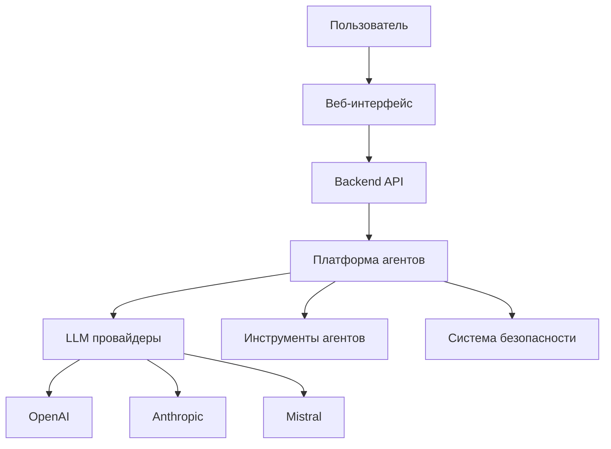
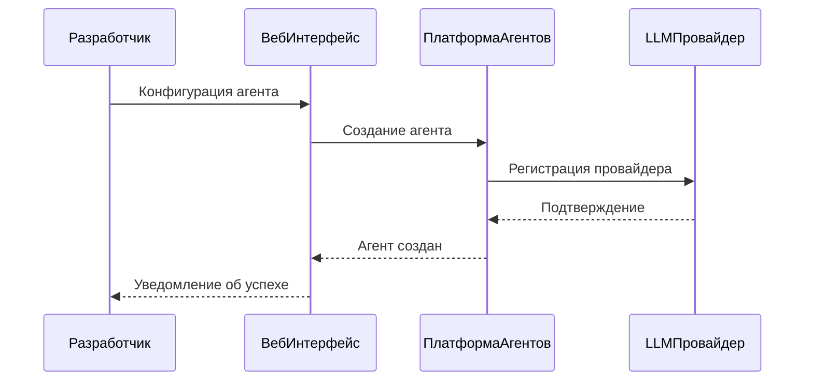

# 🌐 SDK Веб-Интерфейса Интеллектуальных Агентов

<div align="center">
  
  
  [](https://github.com/ivan-meer/agents-sdk-web-ui/stargazers)
  [](https://github.com/ivan-meer/agents-sdk-web-ui/issues)
  [](LICENSE)
  [](https://github.com/ivan-meer/agents-sdk-web-ui/commits)
  [](https://github.com/ivan-meer/agents-sdk-web-ui/actions)
</div>

<p align="center">
  <a href="README.md">
     English
  </a> | 
  <b>
     Русский
  </b>
</p>

## 🔍 Обзор проекта

**SDK Веб-Интерфейса AI-Агентов** — это инновационная платформа, разработанная для революционного изменения способов создания, управления и взаимодействия с интеллектуальными AI-агентами. В эпоху стремительного технологического прогресса наш SDK предоставляет комплексный набор инструментов, упрощающий сложный процесс разработки адаптивных и интеллектуальных систем.

> 💡 **Ключевая философия**: Демократизация разработки AI-агентов путем предоставления гибкого, безопасного и удобного фреймворка, который расширяет возможности разработчиков любого уровня квалификации.

В современном быстро меняющемся цифровом ландшафте AI-агенты трансформируют способы решения комплексных задач бизнесом и частными лицами:
- Автоматизация повторяющихся задач
- Предоставление интеллектуальных аналитических данных
- Совершенствование процессов принятия решений
- Обеспечение персонализированного пользовательского опыта

## ✨ Ключевые возможности

<table>
  <tr>
    <td width="50%">
      <h3>🧠 Интеллектуальное управление агентами</h3>
      <ul>
        <li>Поддержка множества моделей ведущих AI-провайдеров (OpenAI, Anthropic, Mistral)</li>
        <li>Гибкие параметры конфигурации с интуитивным интерфейсом</li>
        <li>Динамическая интеграция инструментов для расширенных возможностей</li>
        <li>Комплексный мониторинг и отслеживание производительности</li>
      </ul>
    </td>
    <td width="50%">
      <h3>🔧 Технические преимущества</h3>
      <ul>
        <li>Кроссплатформенная совместимость для разнообразного развертывания</li>
        <li>Продвинутые механизмы безопасности с аутентификацией OAuth2</li>
        <li>Масштабируемая микросервисная архитектура для корпоративных нужд</li>
        <li>Расширяемая система плагинов для настраиваемой функциональности</li>
      </ul>
    </td>
  </tr>
</table>

## 🏗️ Системная архитектура



Наша архитектура разработана с учетом модульности и масштабируемости, обеспечивая безупречную интеграцию и расширение возможностей AI по мере развития ваших потребностей.

## 💻 Технологический стек

<div align="center">
  <h3>Backend</h3>
  
  
  
  
  <h3>Frontend</h3>
  
  
  
</div>

Каждая технология тщательно подобрана для обеспечения оптимальной производительности, удобства разработки и перспективности для ваших реализаций AI-агентов.

## 🔄 Рабочий процесс создания агента



Этот рабочий процесс иллюстрирует оптимизированный процесс создания и развертывания интеллектуальных агентов через нашу платформу.

## ⚡ Быстрый старт

### Предварительные требования
- Python 3.9 или выше
- Node.js 18 или выше
- Docker (опционально, для контейнеризованного развертывания)
- API-ключи для желаемых LLM-провайдеров

### Установка

```bash
# Клонирование репозитория
git clone https://github.com/ivan-meer/agents-sdk-web-ui.git
cd agents-sdk-web-ui

# Настройка backend
python -m venv venv
source venv/bin/activate  # На Windows: venv\Scripts\activate
pip install -r requirements.txt

# Настройка переменных окружения
cp .env.example .env
# Отредактируйте .env, добавив свои API-ключи

# Настройка frontend
cd frontend
npm install

# Запуск приложения
# Терминал 1: Backend
cd ../backend
python main.py

# Терминал 2: Frontend
cd ../frontend
npm run dev
```

### Установка с Docker

```bash
# Клонирование и настройка
git clone https://github.com/ivan-meer/agents-sdk-web-ui.git
cd agents-sdk-web-ui
cp .env.example .env
# Отредактируйте .env, добавив свои API-ключи

# Сборка и запуск с Docker
docker-compose up --build
```

После установки приложение будет доступно по адресу: [http://localhost:3000](http://localhost:3000)

## 📚 Документация

<table>
  <tr>
    <td width="33%">
      <h3>🏗 Архитектура</h3>
      <ul>
        <li><a href="/docs/ARCHITECTURE.md">Обзор архитектуры</a> (Обновлено 2025-03-20)</li>
        <li><a href="/docs/API.md">Справочник API</a> (Обновлено 2025-03-22)</li>
        <li><a href="/docs/DEPLOYMENT.md">Руководство по развертыванию</a> (Обновлено 2025-03-18)</li>
      </ul>
    </td>
    <td width="33%">
      <h3>👩‍💻 Разработка</h3>
      <ul>
        <li><a href="/docs/FRONTEND.md">Руководство по Frontend</a> (Обновлено 2025-03-24)</li>
        <li><a href="/docs/DOCUMENTATION_GUIDE.md">Документация AI-агентов</a> (Обновлено 2025-03-24)</li>
        <li><a href="/CONTRIBUTING.md">Руководство по участию</a></li>
      </ul>
    </td>
    <td width="33%">
      <h3>🛠️ Шаблоны</h3>
      <ul>
        <li><a href="/.github/ISSUE_TEMPLATE/bug_report.md">Шаблон отчета о баге</a></li>
        <li><a href="/.github/ISSUE_TEMPLATE/feature_request.md">Шаблон запроса функционала</a></li>
        <li><a href="/SECURITY.md">Политика безопасности</a></li>
      </ul>
    </td>
  </tr>
</table>

## 🛡️ Безопасность

Безопасность является основным приоритетом нашей платформы. Недавние улучшения безопасности включают:

- Внедрение аутентификации OAuth2 (2025-03-15)
- Усовершенствованные механизмы ограничения скорости (2025-03-18)
- Улучшенная санитизация ввода на всех конечных точках (2025-03-20)

Для сообщения об уязвимостях, пожалуйста, обращайтесь:
- Email: security@aiagents.com
- Информация о процедурах в [Политике безопасности](/SECURITY.md)

## 🏆 Этапы проекта

<table>
  <tr>
    <th>Этап</th>
    <th>Статус</th>
    <th>Дата</th>
  </tr>
  <tr>
    <td>Базовая архитектура</td>
    <td>✅ Завершено</td>
    <td>2025-02-15</td>
  </tr>
  <tr>
    <td>Поддержка нескольких моделей</td>
    <td>✅ Завершено</td>
    <td>2025-03-01</td>
  </tr>
  <tr>
    <td>Основная документация</td>
    <td>✅ Завершено</td>
    <td>2025-03-20</td>
  </tr>
  <tr>
    <td>Базовые инструменты безопасности</td>
    <td>✅ Завершено</td>
    <td>2025-03-15</td>
  </tr>
  <tr>
    <td>Продвинутые инструменты безопасности</td>
    <td>🔄 В процессе</td>
    <td>ETA 2025-04-10</td>
  </tr>
  <tr>
    <td>Начальная масштабируемость</td>
    <td>✅ Завершено</td>
    <td>2025-03-10</td>
  </tr>
  <tr>
    <td>Полная масштабируемость</td>
    <td>🔄 В процессе</td>
    <td>ETA 2025-04-15</td>
  </tr>
  <tr>
    <td>Оптимизация производительности</td>
    <td>📅 Запланировано</td>
    <td>ETA 2025-04-20</td>
  </tr>
</table>

## 📜 Лицензия

Этот проект лицензирован в соответствии с лицензией MIT - подробности см. в файле [LICENSE](/LICENSE).

## 📫 Контакты и сообщество

- **📧 Email**: ivan.meer1990@gmail.com
- **💻 GitHub**: [@ivan-meer](https://github.com/ivan-meer)
- **🌐 Веб-сайт**: [aiagents.com](https://aiagents.com)
- **💬 Обсуждения**: [Обсуждения на GitHub](https://github.com/ivan-meer/agents-sdk-web-ui/discussions)

---

<p align="center">
  <br>
  <strong>🚀 Создано с ❤️ сообществом разработчиков AI</strong><br>
  <small>© 2025 Иван Меер и контрибьюторы</small>
</p>