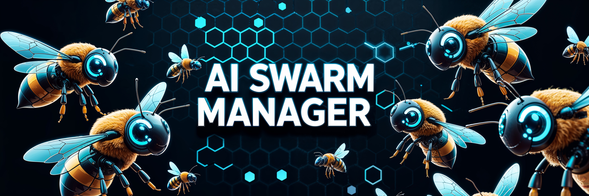

# 🤖 SDK Веб-Интерфейса Интеллектуальных Агентов

[🇬🇧 English Version](README.md)

## 🌟 Обзор проекта

> SDK Веб-Интерфейса AI-Агентов - это мощная и гибкая платформа для создания, управления и взаимодействия с интеллектуальными агентами на базе искусственного интеллекта.



## 🚀 Ключевые возможности

### Комплексное управление агентами
- Создание и настройка AI-агентов с легкостью
- Поддержка множества языковых моделей (LLM)
- Гибкая экосистема инструментов и интеграций

### Передовые возможности
- 🧠 Поддержка нескольких моделей (OpenAI, Anthropic, Mistral)
- 🛡️ Расширенные механизмы безопасности
- 📊 Всесторонняя трассировка и мониторинг агентов
- 🔌 Расширяемая архитектура плагинов

## 💡 Почему SDK AI-Агентов?

В современном быстро меняющемся технологическом ландшафте AI-агенты становятся критически важными для:
- Автоматизации сложных задач
- Улучшения процессов принятия решений
- Оптимизации рабочих процессов

Наш SDK обеспечивает:
- **Упрощенную разработку агентов**: Создавайте сложных AI-агентов без глубоких инфраструктурных знаний
- **Кроссплатформенную совместимость**: Работает безупречно в различных средах
- **Масштабируемую архитектуру**: Проектируйте агентов, которые растут вместе с вашим проектом

## 🛠 Технологический стек

### Backend


### Frontend


## 🚀 Быстрый старт

### Предварительные требования
- Python 3.9+
- Node.js 18+
- Docker (опционально)

### Установка

```bash
# Клонировать репозиторий
git clone https://github.com/ivan-meer/agents-sdk-web-ui.git
cd agents-sdk-web-ui

# Настройка backend
python -m venv venv
source venv/bin/activate
pip install -r requirements.txt

# Настройка frontend
cd frontend
npm install
```

### Запуск приложения

```bash
# Запуск backend
python backend/main.py

# Запуск frontend
npm run dev --prefix frontend

# Или использовать Docker
docker-compose up --build
```

## 📘 Документация

- [Обзор архитектуры](docs/ARCHITECTURE.md)
- [Справочник API](docs/API.md)
- [Руководство по развертыванию](docs/DEPLOYMENT.md)
- [Руководство по участию](CONTRIBUTING.md)

## 🤝 Участие в проекте

Мы приветствуем contributions! Пожалуйста, ознакомьтесь с [Руководством по участию](CONTRIBUTING.md).

### Способы участия
- Сообщать о багах
- Предлагать новые функции
- Отправлять pull request'ы
- Улучшать документацию

## 🛡️ Безопасность

При обнаружении уязвимостей, пожалуйста, напишите на security@aiagents.com.

## 📊 Статус проекта


## 📜 Лицензия

Проект распространяется под лицензией MIT - подробности в файле [LICENSE](LICENSE).

## 📞 Контакты

- **Email**: ivan.meer1990@gmail.com
- **GitHub**: [@ivan-meer](https://github.com/ivan-meer)

---

<p align="center">
    <strong>Создано с ❤️ сообществом AI-Агентов</strong>
</p>
