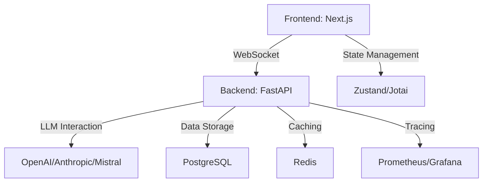

# Архитектура AI Agents Platform

## 🏗 Общая архитектура

Проект построен на микросервисной архитектуре с модульным подходом, разделенный на два основных компонента:

1. **Backend (Python, FastAPI)**
2. **Frontend (Next.js, React)**

### 📦 Компоненты Backend

#### 1. Agent Platform
- Ядро системы управления агентами
- Реализация логики взаимодействия с LLM
- Mechanизмы безопасности и трассировки

#### 2. API Layer
- REST и WebSocket эндпоинты
- Маршрутизация запросов
- Валидация входящих данных

#### 3. Services
- Сервисы интеграции с внешними системами
- Абстракции для работы с LLM
- Механизмы аутентификации и авторизации

#### 4. Tracing
- Система логирования и мониторинга
- Сбор метрик производительности
- Отслеживание выполнения агентов

### 🖥 Компоненты Frontend

#### 1. UI Components
- Интерактивные компоненты React
- Адаптивный дизайн
- Настраиваемые виджеты агентов

#### 2. State Management
- Управление глобальным состоянием
- Синхронизация с backend
- Кэширование данных

#### 3. Authentication
- Механизмы входа и регистрации
- Управление сессиями
- Интеграция с провайдерами OAuth

## 🔗 Взаимодействие компонентов

## 🛡 Безопасность

- Шифрование данных в транзите (HTTPS/WSS)
- Механизмы rate limiting
- Валидация входных данных
- Изоляция выполнения агентов

## 📊 Масштабируемость

- Горизонтальное масштабирование backend
- Кэширование на уровне Redis
- Асинхронная обработка задач
- Поддержка множества LLM провайдеров

## 🔍 Мониторинг

- Prometheus для сбора метрик
- Grafana для визуализации
- Логирование с использованием structlog
- Трейсинг запросов

## 💻 Локальная разработка

### Требования
- Python 3.9+
- Node.js 18+
- Docker (опционально)

### Workflow
1. Backend development
   - Pytest для тестирования
   - Pylint для линтинга
   - Black для форматирования

2. Frontend development
   - Jest для тестирования
   - ESLint для линтинга
   - Prettier для форматирования

## 🚀 Развертывание

- Docker Compose для локальной разработки
- Kubernetes для production
- CI/CD через GitHub Actions
- Автоматизированное тестирование

## 📝 Рекомендации

- Следуйте принципам SOLID
- Используйте dependency injection
- Разделяйте бизнес-логику и инфраструктуру
- Максимизируйте тестируемость кода

## 🔮 Будущее развитие

- Поддержка новых LLM
- Улучшенные механизмы безопасности
- Расширенная система плагинов
- Мультиязычность интерфейса
