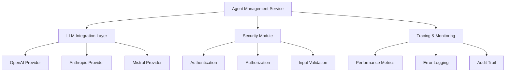
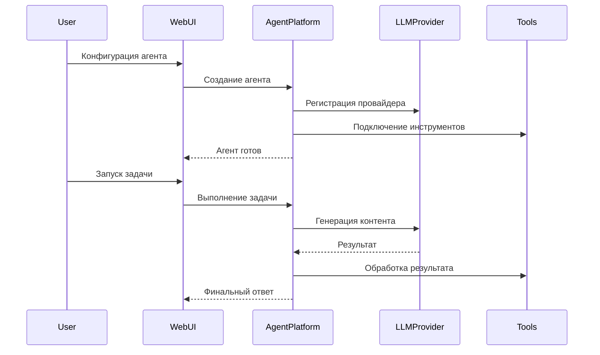

# 🏗 Архитектура AI Agents SDK

## 📝 Введение

Архитектура нашего AI Agents SDK разработана с учетом современных требований к построению масштабируемых и гибких систем искусственного интеллекта. Основная цель - создание платформы, которая обеспечивает максимальную гибкость и расширяемость при работе с интеллектуальными агентами.

## 🌐 Концептуальная модель

### Основные компоненты системы

1. **Agent Platform** (Платформа агентов)
   - Ядро системы управления AI-агентами
   - Отвечает за жизненный цикл агентов
   - Обеспечивает абстракцию взаимодействия с различными LLM-провайдерами

2. **Modular Architecture** (Модульная архитектура)
   - Каждый компонент системы разрабатывается как независимый микросервис
   - Возможность легкой замены и расширения функциональности
   - Поддержка принципа единственной ответственности (Single Responsibility Principle)

## 🔍 Детальная архитектура

### Backend Components

### Workflow создания и выполнения агента

## 🛡️ Принципы безопасности

1. **Изоляция выполнения**
   - Каждый агент выполняется в изолированном контексте
   - Строгий контроль доступа к ресурсам
   - Механизмы sandboxing

2. **Многоуровневая аутентификация**
   - JWT-токены
   - Двухфакторная аутентификация
   - Роль-based access control (RBAC)

## 🔧 Расширяемость

### Механизмы расширения

- **Plugin System** (Система плагинов)
  - Динамическая загрузка инструментов
  - Независимая разработка расширений
  - Поддержка различных типов интеграций

- **Dependency Injection**
  - Инверсия управления
  - Легкая замена компонентов
  - Упрощение тестирования

## 📊 Масштабируемость

1. **Горизонтальное масштабирование**
   - Stateless архитектура backend
   - Кэширование через Redis
   - Балансировка нагрузки

2. **Оптимизация производительности**
   - Асинхронная обработка задач
   - Кэширование промежуточных результатов
   - Оптимизация запросов к LLM

## 🌈 Поддерживаемые сценарии использования

- Автоматизация бизнес-процессов
- Интеллектуальная поддержка клиентов
- Аналитика и обработка данных
- Генерация контента
- Исследовательские задачи

## 🚧 Текущие ограничения

- Зависимость от внешних LLM-провайдеров
- Потенциальные задержки при генерации контента
- Необходимость постоянного обновления инструментов

## 🔮 Roadmap развития

- [ ] Полная поддержка мультимодальных агентов
- [ ] Расширенная система мониторинга
- [ ] Интеграция с облачными сервисами
- [ ] Улучшенные механизмы безопасности

## 🤝 Философия проекта

Наша цель - создать экосистему, которая делает разработку AI-агентов доступной, безопасной и эффективной для разработчиков любого уровня подготовки.
