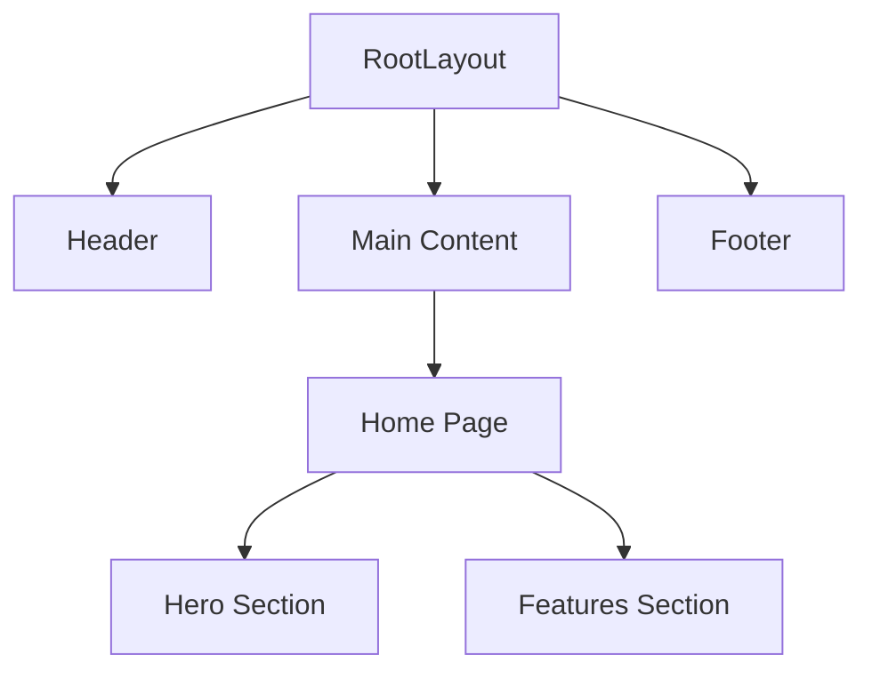

# Архитектура фронтенда

## Обзор

Фронтенд платформы AI Agents Platform построен с использованием Next.js 14 и React 18, применяя App Router для маршрутизации и рендеринга на стороне сервера. Он следует компонентно-ориентированной архитектуре с акцентом на модульность, переиспользуемость и производительность.

**Основные цели фронтенда:**

- Предоставить удобный интерфейс для управления и взаимодействия с AI агентами.
- Предложить понятный и интуитивный способ настройки агентов, инструментов и параметров.
- Визуализировать выполнение агентов и результаты в реальном времени.
- Обеспечить адаптивный и доступный опыт на различных устройствах.

**Ключевые принципы архитектуры фронтенда:**

- **Компонентно-ориентированная архитектура**: Построение UI с использованием переиспользуемых компонентов для поддержки и масштабируемости.
- **React Server Components**: Использование серверных компонентов для улучшения производительности и уменьшения JavaScript на стороне клиента.
- **Безопасность типов**: Использование TypeScript для повышения качества кода и удобства поддержки.
- **Современный UI**: Реализация чистого и современного дизайна с компонентами Tailwind CSS и shadcn/ui.
- **Управление состоянием**: Применение Zustand для глобального управления состоянием и React Context для локального состояния компонентов.

## Технологический стек

- **UI Framework**: [](https://nextjs.org/) (App Router)
- **UI Library**: [](https://reactjs.org/) 
- **Styling**: [](https://tailwindcss.com/) + CSS Modules
- **Language**: [](https://www.typescriptlang.org/)
- **Components**: [](https://ui.shadcn.com/)
- **Icons**: [](https://lucide.dev/)
- **State Management**: [](https://zustand.js.org/)
- **Data Fetching**: [](https://tanstack.com/query/v5/)
- **Form Handling**: [](https://react-hook-form.com/)
- **Linting**: [](https://eslint.org/)
- **Formatting**: [](https://prettier.io/)
- **Testing**: [](https://jestjs.io/) + [](https://testing-library.com/docs/react-testing-library/intro/)
- **Bundler**: [](https://webpack.js.org/) (через Next.js)

## Структура компонентов



Архитектура фронтенда основана на переиспользуемых и модульных компонентах. Компоненты организованы по следующим категориям:

- **Layout Components**:
  * **`Header`**: Глобальный хедер с навигацией и брендингом.
  * **`Footer`**: Глобальный футер с информацией об авторских правах и ссылками.
  * **`Sidebar`**: (Планируется) Боковая панель для навигации и настроек.

- **Page Components**:
  * **`Home`**: Лендинг с обзором проекта и призывами к действию.
  * **`Agents`**: Страница для управления и настройки AI агентов.
  * **`Tools`**: Страница для управления и настройки инструментов.
  * **`Settings`**: Страница для пользовательских настроек и предпочтений.
  * **`Runs`**: Страница для просмотра истории выполнения агентов и результатов.

- **UI Components**:
  * **`Button`**: Переиспользуемый компонент кнопки с различными стилями и вариантами.
  * **`Input`**: Переиспользуемый компонент ввода для текста, чисел и других типов данных.
  * **`Modal`**: Переиспользуемый компонент модального окна для диалогов и всплывающих окон.
  * **`Table`**: Переиспользуемый компонент таблицы для отображения данных в табличном формате.
  * **`Card`**: Переиспользуемый компонент карточки для отображения информации в контейнере.
  * **`Dropdown`**: Переиспользуемый компонент выпадающего списка для выбора опций.
  * **`Tabs`**: Переиспользуемый компонент вкладок для навигации внутри страницы.

- **Data Components**:
  * **`AgentList`**: Компонент для отображения списка агентов.
  * **`ToolList`**: Компонент для отображения списка инструментов.
  * **`RunResults`**: Компонент для отображения результатов выполнения агентов.
  * **`AgentForm`**: Компонент для создания и редактирования конфигураций агентов.
  * **`ToolForm`**: Компонент для создания и редактирования конфигураций инструментов.

Эта структура компонентов обеспечивает прочную основу для построения масштабируемого и поддерживаемого фронтенд приложения. По мере развития проекта будут добавляться новые компоненты и улучшаться существующие.

## Управление состоянием

Управление состоянием во фронтенде осуществляется с использованием комбинации **Zustand** для глобального состояния и **React Context** для локального состояния компонентов.

- **Zustand**: Используется для управления глобальным состоянием приложения, таким как:
  * Конфигурации агентов
  * Конфигурации инструментов
  * Пользовательские настройки
  * Тема приложения
  * Статус аутентификации

  **Zustand** предоставляет простой и эффективный способ управления глобальным состоянием с минимальным количеством шаблонного кода. Хранилища определяются как простые функции, которые возвращают состояние и действия для обновления состояния. Компоненты могут подписываться на определенные части хранилища и перерисовываться только при изменении этих частей.

- **React Context**: Используется для управления локальным состоянием внутри дерева компонентов, таким как:
  * Состояние формы
  * Состояние UI компонентов (например, видимость модального окна, выбор вкладки)
  * Контекст темы для компонентов

  **React Context** предоставляет способ передачи данных через дерево компонентов без необходимости вручную передавать пропсы на каждом уровне. Он полезен для обмена состоянием, которое является локальным для определенной части приложения.

Эта комбинация **Zustand** и **React Context** обеспечивает гибкий и масштабируемый подход к управлению состоянием во фронтенд приложении. **Zustand** используется для глобального, общеприкладного состояния, а **React Context** используется для локального, компонентно-специфического состояния.

## Маршрутизация

Фронтенд использует **[Next.js App Router](https://nextjs.org/docs/app)** для маршрутизации и навигации.

**Ключевые особенности реализации маршрутизации:**

- **Маршрутизация на основе файловой системы**: Маршруты определяются структурой директорий в директории `src/app`. Каждая папка в `app` представляет сегмент маршрута, а специальные файлы, такие как `page.tsx` и `layout.tsx`, определяют обработчики маршрутов и макеты.
- **`page.tsx`**: Файл `page.tsx` в директории сегмента маршрута делает директорию общедоступной в качестве маршрута. Он определяет UI для этого маршрута.
- **`layout.tsx`**: Файл `layout.tsx` определяет макет UI для сегмента маршрута и всех его дочерних маршрутов. Макеты используются для создания общих элементов UI, таких как хедеры и футеры, которые сохраняются на нескольких страницах.
- **Вложенные маршруты**: Вложенные папки создают вложенные маршруты. Например, `app/agents/create/page.tsx` создает маршрут `/agents/create`.
- **Динамические маршруты**: Динамические сегменты маршрутов могут быть созданы с использованием имен папок в квадратных скобках, например, `app/agents/[agentId]/page.tsx` создает динамический маршрут, который соответствует путям, таким как `/agents/123` или `/agents/456`.
- **Ссылки между страницами**: Компонент `Link` из `next/link` используется для навигации на стороне клиента между страницами.

**Пример структуры маршрутизации:**

```
src/app
├── layout.tsx         # Корневой макет
├── page.tsx           # Маршрут главной страницы (/)
├── agents/
│   ├── layout.tsx     # Макет агентов (/agents/*)
│   ├── page.tsx       # Страница списка агентов (/agents)
│   ├── [agentId]/     # Динамические маршруты агентов (/agents/[agentId])
│   │   └── page.tsx   # Страница деталей агента (/agents/[agentId])
│   └── create/
│       └── page.tsx   # Страница создания агента (/agents/create)
└── tools/
    └── page.tsx       # Страница инструментов (/tools)
```

Эта система маршрутизации на основе файловой системы предоставляет понятный и интуитивный способ определения и управления маршрутами во фронтенд приложении.

## Получение данных

Получение данных во фронтенде в основном обрабатывается с использованием **[TanStack Query](https://tanstack.com/query/v5/)**.

**Ключевые особенности реализации получения данных:**

- **Декларативное получение данных**: TanStack Query позволяет декларативно получать данные с использованием хуков, таких как `useQuery` и `useMutation`. Компоненты описывают свои зависимости от данных, а TanStack Query обрабатывает получение, кэширование и обновление данных.
- **Кэширование**: TanStack Query предоставляет мощный механизм кэширования, который уменьшает избыточные запросы и повышает производительность. Данные кэшируются в кэше на стороне клиента и могут быть настроены с различными политиками кэширования.
- **Фоновые обновления**: TanStack Query автоматически обновляет данные в фоновом режиме, гарантируя, что UI всегда отображает самую последнюю информацию.
- **Оптимистичные обновления**: TanStack Query поддерживает оптимистичные обновления для мутаций, обеспечивая более плавный пользовательский опыт за счет немедленного обновления UI и отката в случае ошибок.
- **Обработка ошибок**: TanStack Query предоставляет надежные механизмы обработки ошибок, позволяя компонентам корректно обрабатывать ошибки получения данных и отображать информативные сообщения об ошибках.
- **Server-Side Rendering (SSR) и Server Components**: TanStack Query разработан для бесшовной работы с Next.js Server Components и SSR. Запросы могут быть предварительно загружены на сервере и гидратированы на клиенте, улучшая производительность начальной загрузки страницы.

**Пример получения данных с помощью `useQuery`:**

```typescript
import { useQuery } from '@tanstack/react-query';

function AgentList() {
  const { data, isLoading, error } = useQuery({
    queryKey: ['agents'],
    queryFn: () => fetch('/api/agents').then(res => res.json()),
  });

  if (isLoading) return <div>Загрузка агентов...</div>;
  if (error) return <div>Ошибка: {error.message}</div>;

  return (
    <ul>
      {data.map(agent => (
        <li key={agent.id}>{agent.name}</li>
      ))}
    </ul>
  );
}
```

Эта стратегия получения данных с помощью TanStack Query упрощает управление данными, повышает производительность и улучшает пользовательский опыт за счет эффективного кэширования и фоновых обновлений.

## Стилизация

Стилизация во фронтенде реализована с использованием **[Tailwind CSS](https://tailwindcss.com/)** и **CSS Modules**.

- **Tailwind CSS**:  **Tailwind CSS** - это utility-first CSS фреймворк, который предоставляет большой набор предопределенных utility классов, которые можно компоновать для стилизации HTML элементов непосредственно в JSX.
  * **Utility-First подход**: Tailwind CSS продвигает utility-first подход, где стили применяются путем компоновки utility классов вместо написания кастомного CSS. Этот подход приводит к более поддерживаемым и консистентным стилям.
  * **Кастомизация**: Tailwind CSS легко настраивается через свой файл конфигурации (`tailwind.config.js`). Тема, цвета, шрифты, брейкпоинты и другие аспекты стилей можно настроить в соответствии с дизайн-требованиями проекта.
  * **Адаптивность**: Tailwind CSS предоставляет адаптивные модификаторы, которые позволяют применять стили условно в зависимости от размеров экрана.

- **CSS Modules**: **CSS Modules** используются для стилизации на уровне компонентов и для стилизации частей приложения, где utility классы Tailwind CSS недостаточны.
  * **Компонентная область видимости**: CSS Modules автоматически ограничивают область видимости CSS классов компонентом, в котором они импортированы. Это предотвращает конфликты имен классов и гарантирует, что стили инкапсулированы внутри компонентов.
  * **Локальные стили**: CSS Modules идеально подходят для стилизации сложных компонентов или для добавления кастомных стилей, специфичных для компонента.

- **`globals.css`**: Файл `frontend/src/styles/globals.css` используется для определения глобальных стилей, таких как:
  * Базовые стили для HTML элементов
  * Глобальные CSS переменные (пользовательские свойства)
  * Директивы Tailwind CSS (`@tailwind base`, `@tailwind components`, `@tailwind utilities`)

Эта стратегия стилизации сочетает в себе преимущества utility-first стилизации с Tailwind CSS и стилизации на уровне компонентов с CSS Modules, обеспечивая гибкий и поддерживаемый подход к стилизации фронтенд приложения.

## Тестирование

Тестирование во фронтенде реализовано с использованием **[Jest](https://jestjs.io/)** в качестве test runner и **[React Testing Library](https://testing-library.com/docs/react-testing-library/intro/)** для тестирования компонентов.

- **Jest**: **Jest** - это JavaScript test runner, который предоставляет комплексное решение для тестирования со следующими функциями:
  * Test runner и библиотека утверждений
  * Возможности мокирования и шпионажа
  * Отчетность о покрытии кода
  * Параллельное выполнение тестов
  * Режим Watch для быстрой обратной связи во время разработки

- **React Testing Library**: **React Testing Library** - это утилита для тестирования, которая фокусируется на тестировании компонентов с точки зрения пользователя.
  * **User-Centric тестирование**: React Testing Library поощряет тестирование компонентов путем взаимодействия с ними так, как это делал бы пользователь, а не путем тестирования деталей реализации.
  * **DOM Queries**: React Testing Library предоставляет утилиты для запросов к DOM таким образом, чтобы отражать взаимодействие пользователей с UI (например, `getByRole`, `getByLabelText`, `getByText`).
  * **Доступность**: React Testing Library продвигает доступность, поощряя тесты, которые взаимодействуют с компонентами доступным способом.

- **Типы тестов**: Стратегия тестирования фронтенда включает:
  * **Unit тесты**: Тестирование отдельных компонентов изолированно, чтобы убедиться, что они функционируют правильно.
  * **Интеграционные тесты**: Тестирование взаимодействий между компонентами и модулями, чтобы убедиться, что они работают вместе, как ожидается.
  * **End-to-End (E2E) тесты**: (Планируется) E2E тесты с использованием Playwright или Cypress для тестирования всего потока приложения с точки зрения пользователя.

**Пример unit теста с использованием React Testing Library и Jest:**

```typescript
import { render, screen } from '@testing-library/react';
import { Button } from '../components/Button';

describe('Button', () => {
  it('renders button with text', () => {
    render(<Button>Click me</Button>);
    const buttonElement = screen.getByRole('button', { name: /click me/i });
    expect(buttonElement).toBeInTheDocument();
  });
});
```
```

Эта стратегия тестирования обеспечивает качество и надежность фронтенд приложения, предоставляя всестороннее покрытие на разных уровнях иерархии компонентов.

## Развертывание

Фронтенд приложение разработано для легкого развертывания на платформах, таких как **[Vercel](https://vercel.com/)**, **[Netlify](https://www.netlify.com/)** или **[AWS](https://aws.amazon.com/)**.

**Развертывание на Vercel (Рекомендуется)**

**[Vercel](https://vercel.com/)** - рекомендуемая платформа для развертывания Next.js приложений благодаря своей бесшовной интеграции и оптимизированной производительности.

**Шаги для развертывания на Vercel:**

1. **Создайте аккаунт Vercel**: Зарегистрируйтесь на Vercel по адресу [https://vercel.com/](https://vercel.com/).
2. **Установите Vercel CLI**: Установите Vercel CLI глобально, используя npm или yarn:

   ```bash
   npm install -g vercel
   ```
3. **Разверните из CLI**: Перейдите в директорию фронтенд проекта в вашем терминале и выполните:

   ```bash
   vercel
   ```
4. **Следуйте подсказкам Vercel CLI**: Vercel CLI проведет вас через процесс развертывания, включая связывание вашего проекта с вашим аккаунтом Vercel и настройку параметров развертывания.
5. **Автоматические развертывания**: После того, как проект настроен на Vercel, любые изменения, отправленные в подключенный Git репозиторий (например, GitHub, GitLab, Bitbucket), автоматически запустят новое развертывание.

**Альтернативные варианты развертывания**

- **Netlify**: **[Netlify](https://www.netlify.com/)** - еще одна популярная платформа для развертывания фронтенд приложений. Развертывание на Netlify аналогично Vercel и может быть выполнено через Netlify CLI или интеграцию с Git.
- **AWS**: **[AWS](https://aws.amazon.com/)** предоставляет различные сервисы для развертывания фронтенд приложений, такие как AWS S3 для статического хостинга и AWS CloudFront для CDN. Развертывание на AWS требует больше ручной настройки, но предлагает большую гибкость и контроль.

Для production развертываний рекомендуется использовать платформу, такую как Vercel или Netlify, для простоты использования и оптимизированной производительности. Для более сложных развертываний или специфических требований к инфраструктуре AWS можно использовать сервисы AWS.

Убедитесь, что переменные окружения настроены правильно для выбранной платформы развертывания, особенно эндпоинты API и любые API ключи, необходимые для взаимодействия фронтенд приложения с бэкендом.
